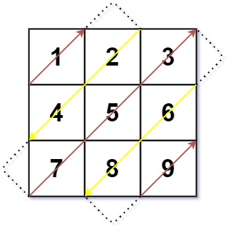
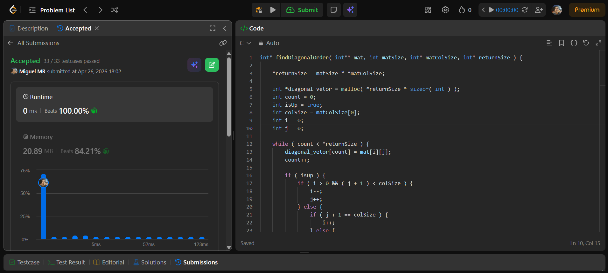

# Miguel Muller da Rosa
# 25100780
# 498.diagonaltraverse.c é o arquivo principal
---

Given an m x n matrix mat, return an array of all the elements of the array in a diagonal order.

Example 1:

Input: mat = [[1,2,3],[4,5,6],[7,8,9]]
Output: [1,2,4,7,5,3,6,8,9]

Example 2:

Input: mat = [[1,2],[3,4]]
Output: [1,2,3,4]

