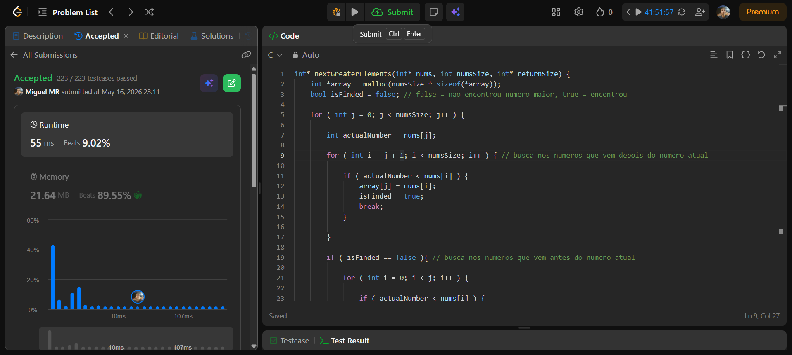
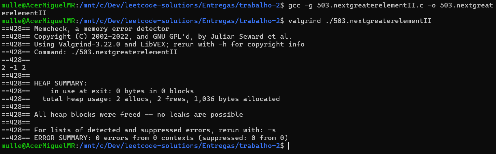

# Trabalho 2 - Next Greater Element II
# Miguel Muller da Rosa
## 25100780
## 503.nextgreaterelementII.c é o arquivo principal
---
Given a circular integer array nums (i.e., the next element of nums[nums.length - 1] is nums[0]), return the next greater number for every element in nums.

The next greater number of a number x is the first greater number to its traversing-order next in the array, which means you could search circularly to find its next greater number. If it doesn't exist, return -1 for this number.

Example 1:

Input: nums = [1,2,1]
Output: [2,-1,2]
Explanation: The first 1's next greater number is 2; 
The number 2 can't find next greater number. 
The second 1's next greater number needs to search circularly, which is also 2.
Example 2:

Input: nums = [1,2,3,4,3]
Output: [2,3,4,-1,4]

---
## imagem do submit:

## imagem do valgrind: 

---

Acredito que o algoritmo implementado no codigo seja O(n^2) devido ao uso de loops aninhados para percorrer o array. Ou seja, para cada elemento do array, o codigo precisa verificar todo o restante e se necessário (caso nao tenha encontrado até chegar ao fim dele) percorrer do inicio até a posição do elemento, o que resulta em uma complexidade quadrática. Já a memoria, a complexidade é O(n) pois o codigo utiliza um array de mesmo tamanho do input para armazenar os resultados, além de algumas variáveis auxiliares que nao dependem do tamanho do input. 