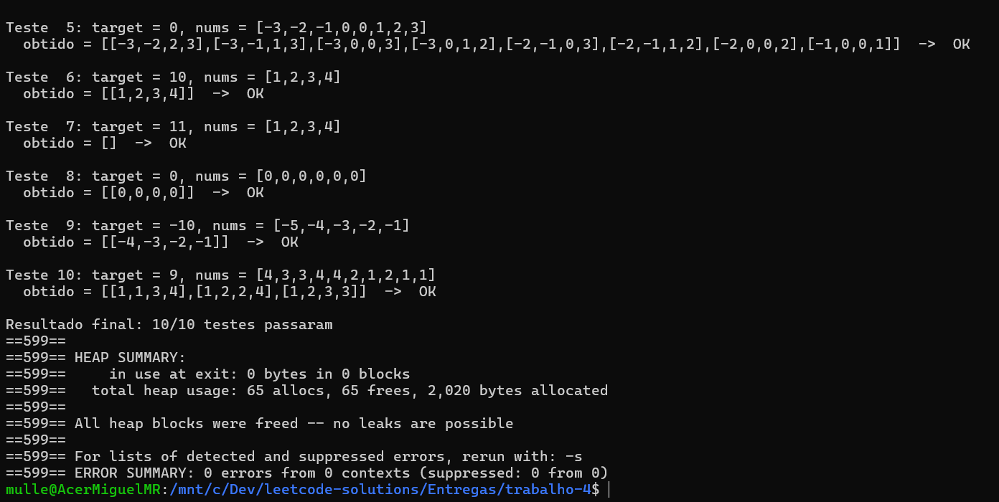

# Trabalho 3 - leetcode 18: 4Sum
# Miguel Muller da Rosa
## 25100780
---

Parte do codigo foi dado em aula pelo professor

---

Given an array nums of n integers, return an array of all the unique quadruplets [nums[a], nums[b], nums[c], nums[d]] such that:

0 <= a, b, c, d < n
a, b, c, and d are distinct.
nums[a] + nums[b] + nums[c] + nums[d] == target
You may return the answer in any order.

Example 1:

Input: nums = [1,0,-1,0,-2,2], target = 0
Output: [[-2,-1,1,2],[-2,0,0,2],[-1,0,0,1]]
Example 2:

Input: nums = [2,2,2,2,2], target = 8
Output: [[2,2,2,2]]
 

Constraints:

1 <= nums.length <= 200
-109 <= nums[i] <= 109
-109 <= target <= 109
---

Acredito que o algoritmo implementado no código tenha complexidade de tempo O(n³). Primeiro, o array é ordenado com qsort, o que custa O(n log n). Em seguida, há dois laços aninhados (i e j) e, para cada combinação deles, é utilizada a técnica de dois ponteiros (k e l), que percorre o restante do vetor apenas uma vez, resultando em O(n) para essa etapa. Assim, a parte dominante da execução é O(n² × n) = O(n³), enquanto a ordenação tem custo menor e não influencia a complexidade final. Já a complexidade de memória é O(m), onde m é a quantidade de quadruplas encontradas, pois o algoritmo aloca dinamicamente um vetor de quatro inteiros para cada solução válida, além do vetor de ponteiros que armazena essas soluções.

---
## imagem do submit:

## imagem do valgrind: 

---

